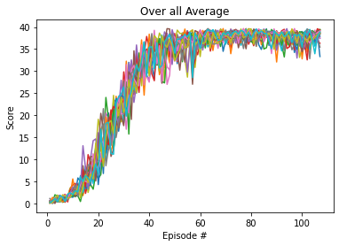

# Problem statement
In this environment, a double-jointed arm can move to target locations. A reward of +0.1 is provided for each step that the agent's hand is in the goal location. Thus, the goal of your agent is to maintain its position at the target location for as many time steps as possible.
The observation space consists of 33 variables corresponding to position, rotation, velocity, and angular velocities of the arm. Each action is a vector with four numbers, corresponding to torque applicable to two joints. Every entry in the action vector should be a number between -1 and 1.
Option 2 was selected in this implementation. To solve the second version, The barrier for solving the second version of the environment is slightly different, to take into account the presence of many agents.  In particular, your agents must get an average score of +30 (over 100 consecutive episodes, and over all agents).  Specifically,
- After each episode, we add up the rewards that each agent received (without discounting), to get a score for each agent.  This yields 20 (potentially different) scores.  We then take the average of these 20 scores. 
- This yields an **average score** for each episode (where the average is over all 20 agents).

# Description of learning algorithm
Deep Deterministic Policy Gradient (DDPG) was used the implementation of this solution. To take advantage of concurrently training a Q-function and a policy. It uses a off-policy and Bellman equation to learn the Q-function, meaning that it updates the Q-values using the Q-value of the greedy action and next state, then use Q-function to learn the policy. The policy and Q-network are similar to Actor Critic but DDPG is deterministic inplace of stochastic and directly maps states to actions instead of outputting the probability distrubution across a directete action space. DDPG uses four neural networks: Q-network, determinstic policy, target Q-network, and target policy. 

# HyperParameters Used:
1) Number of episodes = 2000
2) Max timesteps = 1000
3) Batch size = 100
4) GAMMA = 0.99
5) TAU = 1e-3
6) Actor Learning Rate = 1e-3
7) Critic Learning Rate = 1e-4
8) Buffer size = 1e6
9) MU = 0.0
10) Theta = 0.15
11) Sigma = 0.2
12) Target Average Score for last 100 episode = 30

# Neural Network Architecture Used:
These implementations are derived ddpg-bipedal and ddpg-pendulum projects found in [deep-reinforcement-learning github](https://github.com/udacity/deep-reinforcement-learning), and have been modified to solve 20 agent reacher environment.

For the actor:
    A multilayer forward popagating neural network with 3 hidden fully connected layers containing 500 neurons for first layer and 300 neurons for the next layer.
    ReLu (Rectified Linear Unit) Activiation function were used over output of each hidden fully connected layer.
    Hyperbolic Tangent (Tanh) function was used over final layer output.

For the critic:
    A multilayer forward popagating neural network with 4 hidden fully connected layers containing 128 neurons for first and second layers. Then 400 neurons for the third and 300 neurons for last layer
    ReLu (Rectified Linear Unit) Activiation function were used over output of each hidden fully connected layer.

# Plot of rewards
A plot of rewards per episode is included to illustrate that the agents are able to receive an average reward (over 100 episodes) of at least 30. The submission reports the number of episodes needed to solve the environment. 

A score of greater or equal to 30 was solved in 107 episodes. Final average score for last episode is 38.14.
The environment was solved in fewer than 1800 episodes!

# Ideas for future work
1) Implementation of Proximal Policy Optimization (PPO)
2) Implementation of Advantage Actor Critic (A2C)
3) Implementation of Asynchronous Advantage Actor Critic (A3C)
4) Implementation of Distributed Distributional Deterministic Policy Gradients (D4PG)
5) Try different Hyperparameters or networks values
    a) Mini banches
    b) Weight decays

Implementation of any one of these or combination of these is likely to produce better results. 
